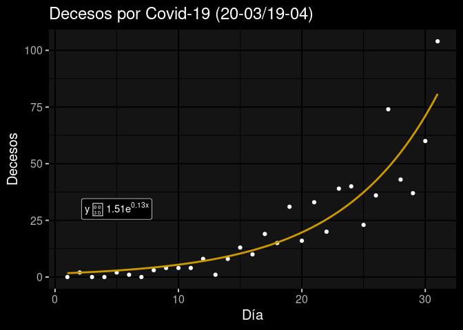

```r
# Carga los paquetes necesarios.
library(ggplot2)
library(ggdark)
library(latex2exp)
library(lubridate)
library(dplyr)
# Configura el directorio de trabajo.
setwd("/home/murphy/Repos/plotcovid19mx")
```


```bash
# Descarga datos del European CDC.
wget -O full.csv https://opendata.ecdc.europa.eu/covid19/casedistribution/csv
# Obtiene las líneas correspondientes a México.
grep Mex full.csv > mex.csv
# Solo ocupamos la columna 1 y 6 (fecha y decesos por día).
awk -F "," '{print $1"," $6}' mex.csv > clean.csv
# Añade nombre a las columnas.
echo "fecha,decesos" >> clean.csv
# Revierte los datos en la lista.
tac clean.csv > clean_r.csv
```

```
## --2020-04-19 14:19:53--  https://opendata.ecdc.europa.eu/covid19/casedistribution/csv
## Resolving opendata.ecdc.europa.eu (opendata.ecdc.europa.eu)... 212.181.0.63
## Connecting to opendata.ecdc.europa.eu (opendata.ecdc.europa.eu)|212.181.0.63|:443... connected.
## HTTP request sent, awaiting response... 301 Moved Permanently
## Location: https://opendata.ecdc.europa.eu/covid19/casedistribution/csv/ [following]
## --2020-04-19 14:19:54--  https://opendata.ecdc.europa.eu/covid19/casedistribution/csv/
## Reusing existing connection to opendata.ecdc.europa.eu:443.
## HTTP request sent, awaiting response... 200 OK
## Length: 605027 (591K) [application/octet-stream]
## Saving to: ‘full.csv’
## 
##      0K .......... .......... .......... .......... ..........  8% 87.5K 6s
##     50K .......... .......... .......... .......... .......... 16%  130K 5s
##    100K .......... .......... .......... .......... .......... 25%  263K 3s
##    150K .......... .......... .......... .......... .......... 33%  233K 3s
##    200K .......... .......... .......... .......... .......... 42%  264K 2s
##    250K .......... .......... .......... .......... .......... 50%  243K 2s
##    300K .......... .......... .......... .......... .......... 59%  260K 1s
##    350K .......... .......... .......... .......... .......... 67%  264K 1s
##    400K .......... .......... .......... .......... .......... 76%  271K 1s
##    450K .......... .......... .......... .......... .......... 84% 3.25M 0s
##    500K .......... .......... .......... .......... .......... 93%  266K 0s
##    550K .......... .......... .......... ..........           100%  110K=2.9s
## 
## 2020-04-19 14:19:57 (204 KB/s) - ‘full.csv’ saved [605027/605027]
```


```r
# Carga los datos limpios a R.
datos <- read.csv("~/Repos/plotcovid19mx/clean_r.csv")
# Cambia el formato de la fecha de d/m/y a y-m-d.
datos$newdate <- lubridate::dmy(datos$fecha)
```


```r
# Crea una nueva variable con un nuevo formato para la fecha (a números enteros).
# Esto se hace porque x con formato de fecha impide que el algoritmo para 
# obtener el modelo exponencial llegue a una solución.
xmax <- max(length(datos$fecha))
datos$number <- seq(0,xmax-1)
# Necesitamos los días del brote en México (después del 20-marzo).
smalldf<-datos %>%
  filter(number >= 72) 
# Ordena los datos a usar en un tibble.
x<-smalldf$number
x<-x-71
y<-smalldf$decesos
nice<-tibble(x,y)
# Guarda datos finales en formato CSV.
write.csv(nice, file="~/Repos/plotcovid19mx/nice.csv")
# Crea una gráfica base.
p <- ggplot(data = nice, aes(x=x, y=y)) + geom_point()
```


```r
# Crea el modelo exponencial.
m <-nls(y~a*exp(b*x), start = list(a=0.6, b=0.16))
# Imprime información del modelo.
summary(m)
```

```
## 
## Formula: y ~ a * exp(b * x)
## 
## Parameters:
##   Estimate Std. Error t value Pr(>|t|)    
## a  1.50967    0.65550   2.303   0.0286 *  
## b  0.12839    0.01558   8.238  4.4e-09 ***
## ---
## Signif. codes:  0 '***' 0.001 '**' 0.01 '*' 0.05 '.' 0.1 ' ' 1
## 
## Residual standard error: 10.16 on 29 degrees of freedom
## 
## Number of iterations to convergence: 5 
## Achieved convergence tolerance: 9.72e-06
```


```r
# Agrega el ajuste exponencial a la gráfica base,
p2 <- p +
  stat_smooth(method = 'nls', formula = y ~ a * exp(b * x), se=FALSE,
              method.args = list(start = list(a = 1.51, b =  0.13))) +
# la ecuación de la exponencial,
      annotate("label", x=5, y=30, label=TeX('$y  =  1.51  e^{0.13  x }$')) +
# los títulos necesarios,
  ylab("Decesos") + xlab("Día") +  ggtitle("Decesos por Covid-19 (20-03/19-04)") 
# y cambia el tema base dependiendo del formato de salida.
if (knitr::is_html_output()) {
  p2 + dark_theme_gray(base_size = 15)
} else if (knitr::is_latex_output()) {
  p2 + theme_light(base_size = 15)
}
```

<!-- -->


```r
# La gráfica en PNG del HTML tiene un error de impresión en la fórmula.
# Este pedazo de código reemplaza la gráfica de salida del pedazo de código 
# anterior con una gráfica creada de manera manual, exportada a PDF y
# convertida a PNG con inkscape. Esto no ocurre con el formato de salida en PDF.
  knitr::include_graphics('/home/murphy/Repos/plotcovid19mx/Rplot01.png')
```

<div class="figure" style="text-align: center">

<p class="caption">Decesos</p>
</div>
